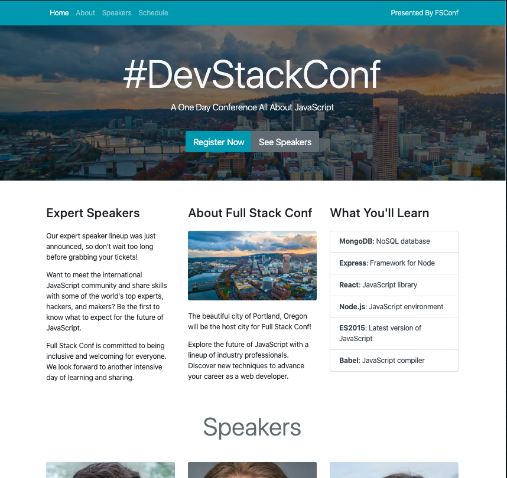
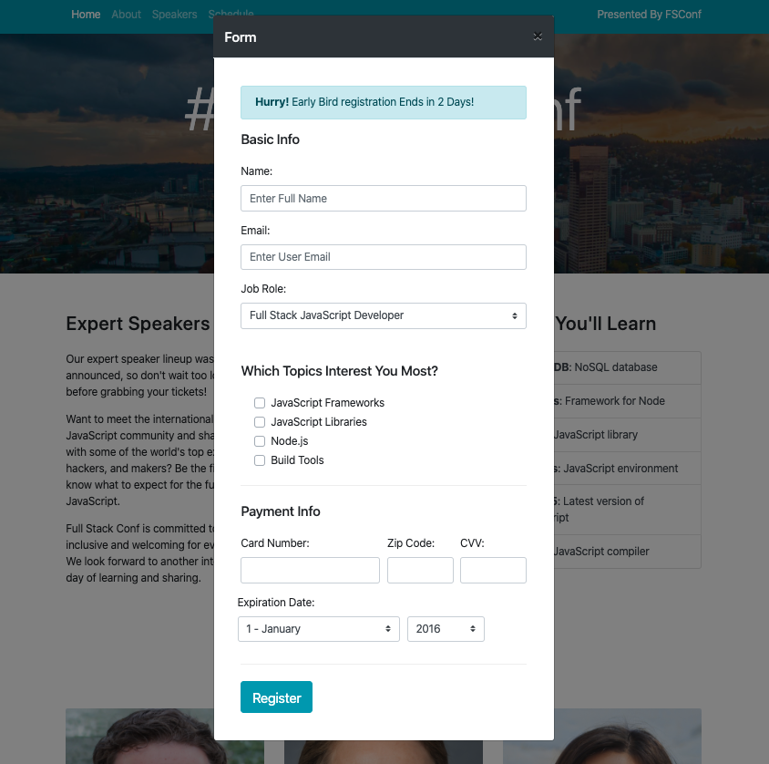

# BootStrap-Advanced_study

Practice project using bootstrap to explore documentation and build a webpage strictly using the Bootstrap Grid, Components, and Utilities. Also a Study in implementing working Form Modal to capture user data such as: Name, Unique Details, and Payment. 

### Author: Bisraddesign (Brad Thompson)

